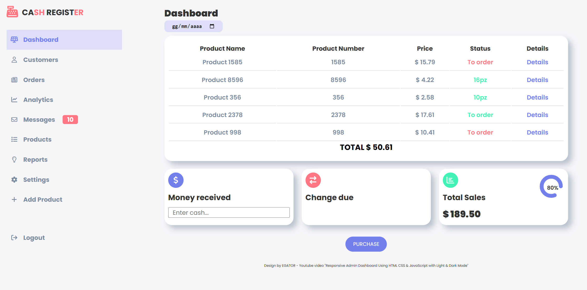

# Cash Register App

A simulated cash register built with vanilla JavaScript. This project is based on a [freeCodeCamp](https://www.freecodecamp.org/) exercise, enhanced with additional features, responsive design, and improved user interface.

## Table of contents

- [Overview](#overview)
  - [Screenshot](#screenshot)
  - [Links](#links)
- [My process](#my-process)
  - [Built with](#built-with)
  - [What I learned](#what-i-learned)
- [Continued development](#continued-development)
- [Author](#author)
- [Acknowledgments](#acknowledgments)

---

## Overview

This app simulates a real-life cash register: it takes a total price and cash input from the customer and returns the appropriate change using the cash available in the drawer. The drawer is pre-filled with defined amounts of each denomination.

### Screenshot

### Links

- Live Site URL: ([https://your-username.github.io/cash-register-app](https://fedelearnstocode.github.io/Cash-Register/))

---

## My process

### Built with

- Semantic HTML5
- CSS (Flexbox + responsive styling)
- Vanilla JavaScript
- DOM manipulation
- Media queries for mobile responsiveness

### What I learned

This project helped reinforce my understanding of:

- Floating point arithmetic in JavaScript (working with money)
- Conditional logic and array manipulation
- Responsive navigation with a custom hamburger menu
- Clean UI state updates and DOM rendering

---

## Continued development

In the future, I'd like to:

- Create a more complete product listing system with quantity selection
- Implement additional pages accessible from the navigation menu
- Add a basic login system to simulate user access

---

## Author

- GitHub: [@FedeLearnsToCode](https://github.com/FedeLearnsToCode)

---

## Acknowledgments

Thanks to **EGATOR** on YouTube — the UI design of this project was taken by one of his great tutorials.
